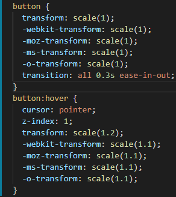
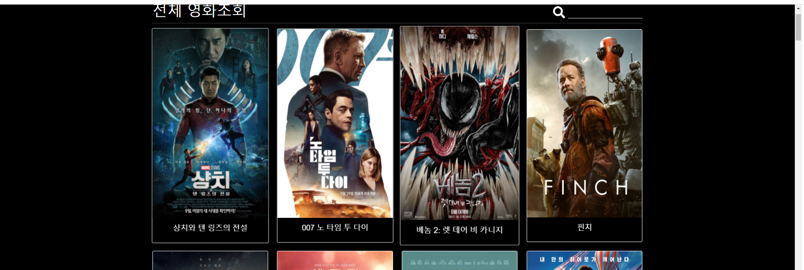

# SSAFY Final Project
> https://www.youtube.com/watch?v=u6IuWsGjQpk
> 🚩**CONTENT**
>
> 1. TEAM
>
>    : 팀원 소개 및 업무 분담 내역
>
> 2. 목표
>
>    : 구현하고자 하는 서비스
>
> 3. ERD
>
>    : 초기 모습
>
> 4. front & back
>
>    - back-end
>      1. 일자별 진행 현황
>      2. 기능 설명
>      4. 최종 소감
>    - front-end
>      1. 일자별 진행 현황
>      2. 기능 설명
>      4. 최종 소감
>
> 5. 최종 구현한 서비스 및 결과

---

<br>

# 1️⃣_TEAM

**열두회**👯‍♂️

* 😎팀장 : 김두회 (front 담당 => Vue를 활용하여 개발)

* 🤪팀원 : 최시열 (back 담당 => Django DRF를 활용하여 개발)

---

<br>

# 2️⃣_목표

**구현하고자 하는 서비스**


---

<br>

# 3️⃣_구상

**ERD**


**URL**


초기 Django를 통해 모든 서버를 구현하고자 하여서 이와 같은 url을 설정 하였다.

---

<br>

# 4️⃣_Front & Back

## 👔Front-end

### 🔆 11/18 오전

#### 💾 Completed

##### 1. main(Home)


##### 2. login


##### 3. signup


##### 4. detail


##### 5. next query


영화 상세정보로 이동하기 전, 로그인 여부를 확인

로그인이 되어있지 않을 시, next 쿼리를 생성하여 로그인 페이지로 이동


로그인 페이지에서 요청을 보내고 isLogin 변수를 watch 함수로 감시.

이때, 로그인이 성공해서 isLogin 되었을 때, next 쿼리에서 정보를 읽고, 그곳으로 라우트되도록 구현.


#### 📛 Error

상세 페이지에서 새로 고침 시에 route 에 데이터가 남지않아서 영화의 정보를 불러올 수 없는 오류가 발생했다.

이에 대한 해결책으로 라우트를 푸시할 때, 쿼리에 필요한 데이터를 담아서 보내면 된다는 것을 깨달았다.


그러면 받는 쪽에서는 이렇게 사용이 가능하다


---

<br>

### 🔆 11/18 오후

#### 💾 Completed

##### 1. API 서버와의 연동으로 영화정보 불러오기


오전까지는 더미데이터를 통해서 영화정보를 불러왔다. 이제는 API 서버로 요청을 보내서 정보를 생성할 수 있다. 현재는 100개의 영화정보 데이터를 받고 있다.


##### 2. 상세영화페이지에 한줄평 생성


영화에 한줄평을 남길 수 있는 기능을 생성하였다.


댓글 작성 내용과 작성자의 정보(유저 ID) 를 보내준다. 

이때, userID 는 JWT에 실려오는 정보에서 추출하여 getters로 불러왔다.


##### 3. 한줄평 삭제 및 수정기능 생성


본인이 작성한 한줄평을 삭제하거나 수정할 수 있는 기능을 추가하였다.


x 버튼을 누를 경우 한줄평이 삭제되고, 삭제된 한줄평이 보이지 않게 된다.


**수정하기** 버튼을 누를 경우, 현재 한줄평이 입력창으로 바뀌고 수정할 수 있게 된다. **enter**를 누르거나 **수정완료** 버튼을 누를 경우 수정할 수 있게 된다.


수정이 완료될 경우 변경된 한줄평이 즉시 보이게 된다.


##### 4. 배경색 변경


영화관 분위기를 연출하기 위해서 배경색을 검은색으로 변경하였다.


배경색을 바꿔주기 위해서, `APP.vue`가 생성되기 전에 body 태그를 잡아서 배경색을 검정으로 변경하였다.

---

<br>

### 🔆 11/19

#### 💾 Completed

##### 1. 비로그인시 영화 한줄평 제한기능


로그인하지 않았을 경우 한줄평을 작성할 수 없도록 하였다. 

`로그인 후 이용가능합니다` 버튼을 클릭시 로그인 페이지로 이동된다.

(여기서 next쿼리를 추가해서 로그인시 바로 영화 상세정보 페이지로 오게하고 싶었지만, 안되서 일단 뒀다.. )


##### 2.영화의 리뷰목록 추가


영화 상세정보 페이지에서 `리뷰보기` 를 클릭할 경우 그 영화의 리뷰 페이지로 오게된다.

리뷰 리스트를 볼 수 있고, 좌측에는 리뷰번호, 중간에는 제목과 평점 오른쪽 끝에는 댓글 숫자가 보이게된다.

추후에 평점을 별 혹은 하트로 나타낼 예정이다.


##### 3. 리뷰작성 기능 추가 & 비로그인시 로그인 페이지 이동


비로그인 상태로 `리뷰작성` 버튼을 누르면 로그인 페이지로 인도된다.

next 쿼리가 있어서 로그인시 바로 리뷰작성 페이지로 넘어간다.


리뷰 작성 페이지 이다. 


랭크에서 평점을 고를 수 있다.


잘못된 요청을 보낼경우 경고창이 뜨고, 작성하고 있던 내용이 초기화 된다.


##### 4. 리뷰 상세페이지 구현 및 리뷰 댓글 CRUD 구현


리뷰 상세페이지를 구현했다. 

아직 리뷰의 `CRUD`중 `UD` 를 구현하지 못했다. 내일 할 예정!! 

대신 댓글의 `CRUD` 를 모두 구현하였다.

영화 상세페이지의 기능과 같으니 따로 사진첨부는 하지 않겠다.


##### 5. 영화 상세페이지 디자인 다듬기


영화 상세페이지의 디자인을 보기좋게 정돈하였다.

이렇게 줄여놓고 보니까 괜찮은것 같기도~~~...??

---

<br>

### 🔆 11/20

#### 💾 Completed

##### 1. 리뷰 삭제기능 구현


`리뷰 수정` 과 `리뷰 삭제` 를 생성하였다. 삭제 버튼을 누르면 다음과 같이 경고창이 나오고 리뷰 목록 페이지로 이동하게 된다.


##### 2. 리뷰 수정기능 구현

- **수정 전 상태**


- **수정하기 페이지**


 `수정하기` 버튼을 누르면 리뷰 수정페이지로 오게된다. 


- **Title, content 채워놓기**

  Title, rank, content 를 수정하려는 게시글의 내용으로 채워주기 위해서 쿼리로 `review_id` 를 받았고, 

  그 id를 토대로 review 상세내용을 서버에 요청해서 받아온다.

  그렇게 받아온 review의 정보를 v-model을 통해서 연결해주었다!! 

  > rank 는 오류가 발생했다.
  >
  > 아마도 받아온 review에는 rank정보가 숫자로 입력되어 있는 반면,
  >
  > option의 value값들은 문자열로 되어있어서 그런 듯하다.
  >
  > 추후에 수정할 예정.


내용을 수정해서 보내면


이렇게 수정된 내용이 나오게 되고 게시글 정보 우측에 있는 마지막 수정일에 `수정됨` 이라는 글자가 추가된다.


- **수정하기 실패 시**


수정 실패시 경고창이 나오게 되고,


다시, 수정하려는 게시글의 내용이 자동으로 채워진다. ( 서버에 현재 review의 상세내용을 재요청하여 바뀐 review의 정보를 초기화 하는 방법 사용.)


- **rank 오류 수정**


option의 value 값을 바인딩하여 해결하였다. 


##### 3. 리뷰 작성하면 해당 리뷰 상세페이지로 보내기

- **수정 전**


- **수정 후**


response 에서 review의 id를 꺼내어 ReviewDetail 페이지의 쿼리에 추가해주었다.


##### 4. 각 페이지별 돌아가기 버튼 추가 (UX)

- **리뷰작성에 취소하기 버튼**


- **리뷰수정에 취소하기 버튼**


- **리뷰상세에 목록으로 버튼**


- **영화 상세에서 전체목록으로 버튼**


##### 5. 좋아요 기능구현


영화를 좋아요 할 수 있는 기능을 구현하였다.


이 좋아요 기능을 구현하면서 위에서 작성했던 로그인 next쿼리를 해결했다.. 정말 힘든 싸움이었다... 이제 자야지...


#### 📛 Error

##### 1. 홈의 제일 위가 아닌 중단으로 돌아가는 오류

`전체 영화목록으로` 버튼을 누르면, 홈으로 돌아가기는 한다. 하지만, 홈의 제일 위가 아닌 중단으로 돌아가는 오류가 발생했다. 


임시 방편으로 `scrollTo` 를 이용해서 스크롤이 제일 위로 올라가게 설정하였다.. 하지만 원인을 모르니 답답할 따름이다 .. ㅠㅠㅠㅠㅠㅠ

##### 2. 영화 상세페이지, 리뷰 게시판, 리뷰상세 등에서 직전의 영화정보들이 잠깐 보이는 오류


페이지가 created 될때, 각 페이지의 저장소를 `commit` 을 통해서 리셋시켜주어서 오류를 해결하였다.

##### 3. 좋아요, 댓글에서 next쿼리 담아서 Login 페이지 보내주기


거의 한시간 반정도 고민했던 문제.. 

next 에다가 `this.$route` 를 `JSON.stringify` 를 해서 보내주려니까 자꾸 오류가 떠서 미쳐버리는 줄 알았다.. 

this.$route도 object 인데 `JSON.stringify` 가 안되는 이유를 모르겠다..

그래도 결국 해결해서 기분이 너무 좋다.. 


#### 📝 Feeling

store/index.js 에 `import router from '@/router/index.js'` 로 라우터를 불러오면 store 에서도 라우트 기능을 사용할 수 있다는 사실을 알게되었다 ㅎㅎ ..

요걸 몰랐네 ><


---

<br>

### 🔆 11/21

#### 💾 Completed

##### 1. 메인페이지 검색기능 추가

- **검색하지 않은 상태**


- **검색하지 않은 상태**


- **구현 방법**


우선, data에서 `searchKeyword`와 `searchList`를 생성하였다.


그후 검색창으로 쓰일 `input` 태그에 `input` 이벤트가 발생할 때마다, `serchMovie` 라는 함수가 호출되도록 하였다. 


`searchMovie` 는 위와 같이 정의하여, 입력이 발생할 때마다 `searchKeyword` 를 검색창의 내용과 같아지도록 해주었다.

> v-model 을 사용하지 않은 이유: 한글의 경우 글자가 한개씩 덜 쳐지는 오류가 발생하기 때문에 검색어에 즉각적인 반응을 할 수 없다.


그 다음으로는 `watch`를 통해서 `searchKeyword` 를 감시하여 값이 변화할 때마다 전체 영화정보에서 현재 검색어를 포함하고 있는 영화를 `filter` 헬프메서드를 통해 `searchList` 에 할당하였다. 

 

마지막으로 영화 목록이 보여지는 부분은 `v-if =!searchKeyword` 를 통해서 현재 검색어가 있는지 없는지를 판단하여 검색어가 없으면 전체 영화정보를, 검색어가 있으면 `searchList` 에서 영화정보를 보여주도록 하였다.3


##### 2. 장르 정보 추가


`span`태그와 `v-for`문을 이용하여 장르를 나타내주었다. `key` 를 활용하여 마지막 요소는 `/` 가 들어가지 않도록 처리하였다.


### 🔆 11/22

#### 💾 Completed

##### 1. 자유게시판(Community) 구현


자유롭게 글을 남길 수 있는 자유게시판을 구현하였다.

리뷰게시판과 마찬가지로 로그인한 사용자만 `게시물 작성` 을 할 수 있도록 하였다. (비로그인시 로그인 페이지로 유도)


게시글 CRUD 및 댓글 CRUD 를 모두 구현하였다.


##### 2. 마이페이지 구현


자신이 좋아요를 누른 영화들을 보여주고, 좋아요를 기반으로 추천영화를 보여주는 페이지를 제작하였다.


##### 3. 마우스 오버시 확대 기능 추가


마우스 오버시에 요소가 확대되는 기능을 추가하였다.

`App.vue` 에서 


다음과 같은 기능을 넣어주고, 확대를 하고 싶은 요소에 `scale` 클래스를 부여하였다.

추가적으로 페이지 내의 모든 버튼에 확대기능을 추가하기 위해서 



버튼에도 scale 과 같은 CSS 를 적용했다. 

이를 통해서 버튼은 모두 찾아다니며 scale 클래스를 부여하지 않아도 되게 되었다.


##### 4. 마이페이지 캐러셀 구현


거의 하루종일 매달려서 구현을 성공해냈다... 

**코드라인**

- `template`


- `scripts`


- `style`


`transform`  의 `translateX`를 사용해서 버튼을 누르면 영화 포스터 한개의 px 만큼 화면을 이동시키는 방식으로 캐러셀을 구현하였다. 


##### 5. 무한 캐러셀로 업그레이드


캐러셀이 현재 영화 갯수의 범위를 벗어나면 처음의 위치로 돌아오거나, 제일 마지막 위치로 가도록 코드를 수정하였다!! 오늘은 이걸로 만족 ㅎㅎ 


##### 6. 네비게이션바 숨기기 & 나타나기

- scroll 다운시 사라짐




- scroll  업시에 다시 등장


**코드 라인**


페이지 전체에 대해서 scroll 이벤트를 사용하기 위해 `App.vue` 가 created 되는 시점에 window 에 `addEventListner` 를 달아주어 scroll을 감지하게 하였다.


scroll 이벤트를 감지하게 되면 `navbarUpDown` 함수가 실행된다. 

data 부분에 미리 선언해놓은 `nowScrollPosition` 이라는 값과 현재의 스크롤 위치를 비교한다.

 직전의 scroll 위치보다 현재 위치가 크다면, 사용자가 아래로 스크롤 하는 중이므로 네비게이션 바를 위로 올린다.

반대로 scroll 위치보다 현재 위치가 작다면, 사용자가 위로 스크롤 하는 중이므로 네비게이션 바를 아래로 내려준다.

캐러셀을 구현하면서 익힌 `transform` 을 사용하였다.


##### 7. 홈 디자인 변경


기존 디자인이 너무 심심한 것 같아서 변경

---

<br>

### 🔆 11/23

#### 💾 Completed

##### 1. 추천영화 추가


'좋아요'를 누른 영화를 기반으로 추천영화 10개를 받아온다.

좋아하는 영화와 마찬가지로 캐러셀을 이용하여 그려주었다.

##### 2. 유튜브 영상추가


`YOUTUBE API` 를 활용하여 영화의 예고편을 불러왔다.

`현재 영화의 제목` + `예고편` 이라는 키워드로 검색하여 가장 처음에 나오는 영화를 첨부하였다.

##### 3. 비장의 무기


영화 월드컵 32강을 구현했다. 

디자인은 아직 안했지만 

다 한걸지도...?

`lodash` 를 활용해서 구현에 성공했다.


---


### 🔆 11/24

#### 💾 Completed

##### 1. 대규모 CSS 작업

**Home**


**Movie Detail**


홈페이지에 전체적으로 CSS 작업을 통해서 디자인을 아기자기하게 변경하였다.


#### 📛 Error

##### 1. 댓글 수정 시 수정된 댓글이 제일 아래로 내려가서 보이는 오류수정


`splice` 를 통해서 댓글을 교체하려 했는데, 그 과정에서 오류가 있어서

`map` 을 활용한 예전의 코드로 다시 수정하였다.

(Git의 중요성을 깨달았다.)

##### 2. 유튜브 요청 초과시 페이지 다운되는 오류발생


기존 코드에서 유튜브 요청 제한량을 초과할 경우 `$store.state.selectedVideo` 가 빈객체가 되어 `$store.state.selectedVideo.id.videoId`를 불러올 때, 오류가 발생하여 페이지가 다운되었다.

그걸 막기 위해 로대쉬의 `isEmpty` 를 사용하여 if 문으로 검사후 URI를 생성해주는 방법으로 해결하였다. 

---

<br>

### 🔆 11/25 프로젝트 마지막 날!

#### 💾 Completed

##### 1. 메인페이지 디자인 수정


색감을 눈에 튀지 않는 색으로 변경하여 이용자들에게 포스터가 더 눈에 띌 수 있도록 변경하였다.

또한 배너의 가로 폭과 영화 목록의 폭을 맞춰주어서 편안한 느낌을 줄 수 있도록 하였다.

##### 2. 마이페이지 색상 변경


마찬가지로 마이페이지 또한 색상을 어두운 색으로 변경하여 영화의 포스터가 더욱 눈에 들어오도록 하였다. 그밖에도 다양한 페이지에서 마진과 패딩값을 조정하며 프로젝트의 디테일한 완성도를 높였다.


#### 📝 Feeling

프로젝트 마지막날. 우리가 기능을 덜 구현한건지.. 아니면 여태까지 힘차게 달려와서 널널한건지는 모르겠지만. 마지막으로 크게 변경할 것들은 없었다. 

최종적으로 기능을 모두 확인하고, 디테일한 요소들을 잡아주는데에 집중하였다.

또한, 추천 알고리즘도 오류가 없는 방향으로 진화시킬 수 있었다.

<br>

### 기능

**필수 기능**

관리자 뷰

영화의 메인 페이지

게시판 CRUD

회원가입 / 로그인 / 로그아웃

영화 좋아요 기능

영화 추천 기능

**추가 기능**

로그인 페이지에 next 쿼리 담아서 보내주기

네비게이션 바 hidden 기능

캐러셀

영화 월드컵 32강

<br>

### 소감

 프로젝트 초반에는 자괴감의 연속이었는데, 어렵다고 생각했던 기능들을 하나하나 구현해나가는 내모습을 볼 수 있었다.

 처음에 프로젝트를 시작할 때, 유튜브 시연영상들을 보면서 '아 내가 과연 저정도로 할 수 있을까' 라는 생각과 걱정이 앞섰는데, 완벽하게는 따라잡지 못하더라도 비슷하게는 짤 수 있었던 것 같다.

 하다보니까 프로젝트에 대한 오기와 열정이 생겨서 매번 새벽까지 작업을 하다가 잠들기도 했고, 

지금 생각하면 정말 별 것 아닌 오류들로 3~4 시간씩 쏟았던 기억도 난다. 

심지어 잘 때에는 코딩하는 꿈을 꿀 정도로 정말 힘든 일주일이었던 것 같다.

그럼에도 불구하고 이정도까지 구현할 수 있다는 사실에 놀랍고, 스스로도 뿌듯하고 대견하다. 

사실 구현하지 못한 기능들이 조금 많아서 아쉬움이 남는다. 

그런 기능들은 추후에 시간이 더 많이 주어지게 된다면, 덧붙여 보고 싶다. 

  추가로, 내 페어 시열이 형이 백엔드를 정말 잘 구성해주어서 편하게 프론트에만 집중할 수 있었던 것 같다.

시열이형 사랑해 취뽀하자 화이팅!

---

<br>


## 🔧Back-end

### 🔆 11/17

#### 💾 Completed

1. 영화 데이터 JSON parsing
2. 기본 코드 구성 (directory 및 file tree 구성 완료)

#### 📛 Error


초기 코드라인을 구성할 때 영화 정보를 loaddata하여 DB에 저장하는 것 까지는 성공했는데

`assertionError`가 발생했다. ~~이거 어디서 많이 본건데..~~

전혀 감이 안잡혀서 구글링해보니 `@api_view` 데코레이터가 빠져서 생긴 오류였다. (이건 진짜 기억 안나😥)

앞으로 갈길이 험난할 것으로 예상된다.. 이런 자잘한것들 다 디버그하려면 많은 시간이 필요할 것 같다.

#### 📝 Feeling

그동안 명세를 받아서 개발하던 습관이 들어서인지 직접 계획해서 짤 때 어려움이 있었다.

팀원과 열심히 회의하고 어렵게 어렵게 모델링을 마쳤는데, 막상 개발 단계에 돌입하니 손봐야할 부분이

우수수 쏟아져 나왔다. **우리가 직접 계획을 수립하고 프로젝트를 진행하기 위해서는 그 부분에 대해서 많이**

**그리고 정확하게 알고 있어야 한다는 것을 느꼈다.** 그동안 공부를 더 깊게 하지 못한것에 후회하는 하루였고

어떻게 공부해야지 라는 방향성도 조금은 잡힌 것 같다.

<br>

### 🔆 11/18

#### 💾 Completed

1. back-end server 구축 완료 (명세에 적혀 있는 기본적인 부분)

#### 📛 Error

> user와의 전쟁...


1. movie_comment를 POST요청으로 한줄평 생성 기능을 만들어 놓고 POSTMAN으로 테스트해보는데

   `NOT NULL constraint failed` 오류에 빠져서 한참을 헤메었다.

   Moviecomment model에서 user를 외래키로 설정해놓았는데 user를 read_olny 처리하여 생긴 문제였다.

   따라서 아직 user가 없는 상태에서 (로그인되지 않은 상태에서) save할 때 user=request.user를 해놓고

   serializer 과정에서 read_only 설정해 주니 이번에는 `ValueError`가 발생하였다.

   결국 임시로 user_id를 넣어서 POST 요청하니 잘 되었다. user 생성 후에 다시 도전해보자!!


2. 어느정도 back-end server가 구조가 잡힌 후에 앞단 vue와 연결을 시도하였다.

   다른 기능은 동작하지만 user_id를 연결하고 주고 받는 문제에 봉착하였다.

   결론부터 이야기하면 back-end에서 user instance를 생성해주지 않은 것이 문제였다.

   처음에는 user 인스턴스를 생성해주지 않고 넘어오는 데이터안의 user를 받으려고 해서 `400` 에러가 있었다.

   그 후에 User 인스턴스를 `get_user_model()`로 생성하여 받아올 때 데이터 위치를 제대로 지정하지 않고

   serializers에서 `read_only` 설정을 해주지 않아 `500` 에러에 마주쳤다.

   해결을 위해 request.data['user']로 user_id를 접근하고 read_only 설정을 해주어 에러를 해결했다.

```python
# movies/views.py

User = get_user_model()

@api_view(['POST'])
@permission_classes([IsAuthenticated])
def movie_comment_create(request, movie_pk):
    '''
    POST: 한줄평 작성
    '''
    if request.method == 'POST':
        movie = get_object_or_404(Movie, pk=movie_pk)
        serializer = MoviecommentSerializer(data=request.data)
        user = User.objects.get(pk=request.data['user']) # user_id에 맞는 user 인스턴스
        username = user.username # user data 중 username
        if serializer.is_valid(raise_exception=True):
            serializer.save(movie=movie, user=user, username=username)
            return Response(serializer.data, status=HTTP_201_CREATED)
```

```python
# movies/serializers/moviecomment.py

from rest_framework import serializers
from ..models import Moviecomment


class MoviecommentSerializer(serializers.ModelSerializer):
    '''
    영화 한줄평 생성 / 수정 (영화 한줄평이 가지고 있는 모든 정보)
    '''

    class Meta:
        model = Moviecomment
        fields = '__all__'
        read_only_fields = ('movie', 'user', 'username', )
```

#### 📝 Feeling

user 에러에 봉착하여 긴 시간을 할애 하였지만 에러를 해결해 나감에 있어서 큰 만족감과 기쁨을 잠시나마

느낄 수 있었던 하루였다. 무엇인가 하나라도 해놓은 하루가 됐다는 사실이 다행이라고 생각한다.

여기에 더해 movie와 movie_comment를 전날에 확실하게 공부해서 개발하다보니 뒤에 따르는 review와

review_comment는 내가 원하는 방향대로 개발하기가 조금은 수월했다.

프로젝트하며 논리와 흐름에 대해서 다시한번 이해해가는 기분이다.

<br>

### 🔆 11/19

#### 💾 Completed

1. model, view 필요한 세부사항 수정 후 그에 맞는 url 재설정
2. user 인증 구현
3. simple jwt customizing

#### 📛 Error

front server에서 username을 쓰기 위해 DB에 저장되어 있는 usernam을 front에 넘겨줘야 하는 문제에 봉착.

아래와 같은 방법들을 거치며 완성하였다.

1. `accounts`의 `Userserializer`를 import 해와서 활용해보기

   ➡ 어떻게 활용해야 하는지 문법을 찾지 못해서 *pass*

2. `MoviecommentSerializer`에 `UserSerializer`를 만들어서 user_set 형태로 해보기

   ➡ comment_set처럼 클래스 변수로 사용하면 될줄 알았는데 안됨.. *pass*

3. `Model`의 `Moviecomment` 클래스에 username이라는 변수를 할당하고 get_user_model을 활용해보기

   ➡ Model class 변수에 `models.`으로 시작해야 하는데 이후에 `get_user_model()`을 작성할 수 없어서 *pass*

4. ⭐그렇다면 `Mode`l의 `Moviecomment` 클래스에 username이라는 변수를 CharField로 할당해주고

   view함수에서 username을 담아서 보내주자!

   ➡ 해결...! 역시 팀원과 함께하는 최종 프로젝트 😆👍

#### 📝 Feeling

원래 계획은 오늘까지 명세에 나와있는 기본적인 기능들을 완성시키는 것이었다.

back-end는 추천 알고리즘을 제외하고 거의 완성하였지만 front에서 생각보다 해줘야 할 일이 많다...!

그래도 어느정도는 구색을 갖추고나니 어떻게 가야할지 방향성이 조금은 명확해지는 기분이다.

많이 부족하다고 느끼는것은 처음 구성단계에서 완벽히는 아니더라도 좀 더 멀리, 꼼꼼히 생각해서 ERD를

짜지 못했다는 것이다. ~~프로젝트를 하는 중간중간마다 바뀌는 사항들이 많다...~~

그러나 이것도 하나의 배움의 단계라고 생각하며 천천히 짜보자! 남은 기간 화이팅🏆🤹‍♀️

<br>

### 🔆 11/22

#### 💾 Completed

1. `community` app 구성 (주말)
2. `profile` 구성 (주말)
3. `credit`이라는 모델로 출연진과 제작팀 데이터 가져오기

#### 📛 Error

출연진과 연출진의 데이터를 가져오는 것에 대한 많은 고민이 있었다. 먼저 movie와의 관계를 생각해야 하고

어떤 형태로 데이터를 긁어올지도 생각해야 했다. model과 fields로 나누어 데이터를 분류하여 가져오는데

초기 설정은 하나의 영화 안에 (장르처럼) `ManyToMany` 필드로 넣고 싶었으나 관계 설정이 어렵고 데이터를

긁어오는 과정에서 넣기가 쉽지 않았다. 따라서 결국에는 cast라는 JSON 파일을 따로 fixture하여 `credit` 모델에

cast와 crew라는 이름의 클래스 변수로 `JsonFeild`를 가지도록 설정하였다.

```python
# movies/models.py

class Credit(models.Model):
    cast = models.JSONField()
    crew = models.JSONField()
```

#### 📝 Feeling

가장 처음 프로젝트에서 했었던 데이터를 JSON화 하여 데이터를 가져오는 방법이 잘 생각나지 않았다.

길면 약 4개월정도 지난 기억이라고 해도 다시 볼 때도 그 기억이 전혀 나지 않아서 실망스러웠다.

**이런 경우에는 의지할 수 있는것은 코드에 쓰인 주석과 README이다.** 그런 의미에서 README 작성의 중요성을

새삼 더 깨닫고 지금 쓰는 이 README가 다시 읽히기를 기대하고 있다.

<br>

### 🔆 11/23

#### 💾 Completed

1. 추천 알고리즘 완성 (기본 알고리즘)

#### 📛 Error

like_movies를 활용해 (related_name) 좋아요를 누른 영화의 목록을 가져올 수 있었는데 우리가 알고리즘을

구현해내기 위해서는 영화의 장르가 필요했다. 오래전에 배운 ORM이 잘 기억나지 않고 장르는 `ManyToMany`

필드이기 떄문에 그에 맞는 ORM이 필요했다. 계속해서 `AttributeError`와 마주한 끝에 결국에는 장르의

아이디 값을 가져올 수 있었고,  장르와 연관지어 관련된 추천 영화 데이터를 보낼 수 있도록 알고리즘을

구현하였다. (예를 들어 `genres__pk` ) 

```python
# movies/views.py

@api_view(['GET'])
@permission_classes([IsAuthenticated])
def recommend(request):
    if request.method == 'GET':
        # user가 좋아요한 영화 가져오기
        user = User.objects.get(pk=request.data['user'])
        visited = [0] * 19
        # genre id 저장
        genres_name_list = (
            12, 14, 16, 18, 27, 28, 35, 36, 37, 53, 80, 99,
            878, 9648, 10402, 10749, 10751, 10752, 10770
        )
        like_movies = user.like_movies.all()
        if not len(like_movies):
            return Response({
                'message': '좋아요한 영화가 없습니다.'
                }, status=HTTP_204_NO_CONTENT
            )
        temp_genres = []
        for like_movie in like_movies:
            like_genres = like_movie.genres.all() # 좋아요한 영화들의 장르 가져오기
            for like_genre in like_genres:
                temp_genres.append(like_genre.id) # 장르 아이디를 저장

        # 가장 많이 나온 장르 뽑아내기
        for genre in temp_genres:
            visited[genres_name_list.index(genre)] += 1 # 장르 아이디가 있는 인덱스에 맞춰 visited +1
        target_genre_id = genres_name_list[visited.index(max(visited))] # 최대 visited 값에 맞는 장르 아이디

        # 얻은 장르 아이디로 관련 영화 뽑아내기
        target_movies = Movie.objects.filter(genres__pk=target_genre_id)
        temp_movies = []
        for target_movie in target_movies:
            # 득표 점수의 신뢰도 향상을 위해 평균과 총 득표수를 곱함
            score = target_movie.vote_count * target_movie.vote_average
            temp_movies.append([score, target_movie.pk])
            temp_movies.sort(key=lambda x: x[0], reverse=True) # 점수 기준 정렬
            temp = temp_movies[:10] # 인덱스 에러 방지를 위해 슬라이싱
            best_movies = []
            for mv in temp:
                best_movie = Movie.objects.get(pk=mv[1])
                serializer = MovieSerializer(best_movie)
                best_movies.append(serializer.data)
        return Response(best_movies)

```

#### 📝 Feeling

추천 알고리즘을 구성할 때 한가지 아쉬웠던 점은 `sql query`문으로 작성하는게 정석이라는 생각이 들었지만...

잘 생각나지 않고 하나하나 찾아보는 것보다 `django ORM`으로 코드를 구현하는것이 더 쉽고 우리가 이해하기

좋아서 그렇게 구성한 부분이 아쉬움이 남는다. ~~우리는 파이썬이 편하다고...!!!~~😭 `sql query`까지 우리가 그동안

배워왔던 모든 내용을 적용해서 프로젝트를 해보고 싶었으나 시간을 맞추려면 하나라도 우리가 잘 아는 방향으로

빠르게 마치는쪽에 비중을 두고 진행해 나가고있다. 오늘까지 기본적인 기능 구현을 모두 마무리하였다.

앞으로 추가적인 기능 (killing point, CSS, 배포 등)들을 해볼 예정이다. 마지막까지 화이팅!

<br>

### 🔆 11/24

#### 💾 Completed

1. 알고리즘 추가 설계
2. 초기 ERD와 비교하기 위하여 현재 상태의 ERD 작성

#### 📛 Error

추천 영화 알고리즘이 영화를 불러올 때마다 왜 100개 밖에 안되는 데이터를 검사하는데 이렇게 오래걸리지라는

생각을 가지고 있었는데 드디어 알고리즘을 보수하다가 그 오류를 발견했다.

우리 알고리즘에서 총 점수별로 sorting을 하는데 그것이 for문 안에 자리하고 있어서 계속 sorting을 진행하고

있었다. 그래서 인덴팅을 앞으로 한칸 빼주니 금방 데이터가 불러와졌다. (++알고리즘을 추가적으로 구현👍)

```python
# movies/views.py

...
                temp_genres.append([like_genre.id, len(like_genres)]) # 장르 아이디를 저장

        cast_list = [] # 출연진 리스트
        crew_list = [] # 연출진 리스트
        for i in range(len(like_movies)):
            credit = Credit.objects.get(pk=like_movies[i].pk)
            serializer = CreditSerializer(credit)
            # 관계자들의 이름만 저장
            for j in range(len(serializer.data['cast'])):
                cast_list.append(serializer.data['cast'][j]['name'])
            for j in range(len(serializer.data['crew'])):
                crew_list.append(serializer.data['crew'][j]['name'])
        cast_list = list(set(cast_list))
        crew_list = list(set(crew_list))
        # 가장 많이 나온 장르 뽑아내기
        i = 0
        weight = 1 # 가중치(좋아요를 누른 순서대로 큰 가중치를 가짐)
        while i < len(temp_genres):
             # 장르 아이디가 있는 인덱스에 맞춰 장르의 개수로 나눈 값에 * 가중치
            visited[genres_name_list.index(temp_genres[i][0])] += round(1 / temp_genres[i][1] * weight, 3)
            if i < 3:
                weight -= 0.2
            i += 1
        target_genre_id = genres_name_list[visited.index(max(visited))] # 최대 visited 값에 맞는 장르 아이디

             
        # 얻은 장르 아이디로 관련 영화 뽑아내기
        target_movies = Movie.objects.filter(genres__pk=target_genre_id)
        temp_movies = []
        for target_movie in target_movies:
            # 득표 점수의 신뢰도 향상을 위해 평균과 총 득표수를 곱함
            target_movie_credit = Credit.objects.get(pk=target_movie.pk)
            serializer = CreditSerializer(target_movie_credit)
            cast_score = 10 # 기본 값
            crew_score = 10
            for i in range(len(serializer.data['cast'])):
                if serializer.data['cast'][i]['name'] in cast_list:
                    cast_score += 8
            for j in range(len(serializer.data['crew'])):
                if serializer.data['crew'][j]['name'] in crew_list:
                    crew_score += 6
            # 득표 점수의 신뢰도 향상을 위해 평균과 총 득표수, 출연, 연출진의 정보 값을 곱해준다.
            score = target_movie.vote_count * target_movie.vote_average * cast_score * crew_score
            temp_movies.append([score, target_movie.pk])
            
            ...
            
        temp_movies.sort(key=lambda x: x[0], reverse=True) # 점수 기준 정렬
        best_movies = []
        for i in range(10):
            best_movie = Movie.objects.get(pk=temp_movies[i][1])
            serializer = MovieSerializer(best_movie)
            best_movies.append(serializer.data)
        return Response(best_movies)
```

#### 📝 Feeling

back-end는 코드라인 구성이 거의 완료된 상태이기도 하고 오늘은 CSS 위주로 함께 front쪽 프로젝트를

진행하였기 때문에 에러가 없는 하루였다 ~~물론 CSS에서 엄청 오류 나온건 안비밀~~ CSS를 팀원과 진행하면서

역시 front는 뭔가 어렵고 막연한 느낌이 드는 기분이었다. 물론 결과값이 바로 보여서 재미는 있었지만

back-end를 다루는 것이 좀 더 재밌고 쉽게(?) 느껴지는 것 같다.

또 계속 하다보니 알고리즘에 대한 욕심도 생겨서 가지고있는 데이터를 좀 더 적극적으로 활용해 추가적으로

로직을 작성해 보았다. 처음에는 어디서부터 짜야할지 굉장히 막막했으나 시작하고 코드라인들이 자리를

잡아가는 느낌이 들고 그러다보니 나도 조금씩 보수를 진행하며 재미를 찾아가는 것 같다.

<br>

### 🔆 11/25

#### 💾 Completed

1. 추천 알고리즘 추가 기능 & 버그 제거
2. 발표 준비

#### 📛 Error

추천 영화를 고를 때 이미 유저가 좋아요 체크를 한 영화는 리스트에서 pop하는 로직을 추가적으로 구현하는데

예를 들어 드라마 장르의 경우 10개의 영화 개수를 채우지 못해 `index out of range` 에러가 발생하였다.

이를 해결하기 위해서 로직을 `while`문으로 감싸준 뒤 `visited`에서 최대 값을 뽑은 것은 0으로 초기화하여 다음

높은 점수를 가진 장르로 빈 추천 영화를 채워줄 수 있도록 만들었다.

#### 📝 Feeling

이제 정말 마지막 날이니만큼 각종 버그들을 고치는데 힘썼다. 마지막으로 발표 준비를 하며 다시 한번 그동안

만들 결과물을 돌아보는 계기가 되었고, 많이 부족하다는 생각과 하고 싶은 것들은 많지만 시간이 많이 부족했다는

생각이 들었다. 프로젝트를 진행하면서 그동안 배운것을 써먹는 느낌보다 또 새로 배워 나가는 기분이라 좋고,

스스로 개인적으로 만들어 나가며 또 배워나갈 수 있도록 노력해야겠다.

---

<br>

### 기능

#### 필수 기능

영화 데이터 크롤링 (TMDB API)

영화 데이터 조회 (& 상세 조회)

영화 한줄평 CRUD

영화 리뷰 CRUD

영화 리뷰 댓글 CRUD

회원 가입

Custom simple jwt

#### 추가 기능

- **swagger**

  front-end와 협업할 때 편하게 API 서버를 알아볼 수 있도록 swagger를 활용하였다.

- **프로필 페이지**

- **커뮤니티 (자유게시판 기능)**

- **영화 좋아요 기능**

- **영화 추천 알고리즘**

  ```python
  # movies/views.py
  
  @api_view(['GET'])
  def recommend(request, user_pk):
      if request.method == 'GET':
          # user가 좋아요한 영화 가져오기
          user = User.objects.get(pk=user_pk)
          visited = [0] * 19
          # genre id 저장
          genres_name_list = (
              12, 14, 16, 18, 27, 28, 35, 36, 37, 53, 80, 99,
              878, 9648, 10402, 10749, 10751, 10752, 10770
          )
          like_movies = user.like_movies.all()
          if not len(like_movies):
              return Response({
                  'message': '좋아요한 영화가 없습니다.'
                  }, status=HTTP_204_NO_CONTENT
              )
          temp_genres = []
          for like_movie in like_movies:
              like_genres = like_movie.genres.all() # 좋아요한 영화들의 장르 가져오기
              for like_genre in like_genres:
                  temp_genres.append([like_genre.id, len(like_genres)]) # 장르 아이디를 저장
  
          cast_list = [] # 출연진 리스트
          crew_list = [] # 연출진 리스트
          for i in range(len(like_movies)):
              credit = Credit.objects.get(pk=like_movies[i].pk)
              serializer = CreditSerializer(credit)
              # 관계자들의 이름만 저장
              for j in range(len(serializer.data['cast'])):
                  cast_list.append(serializer.data['cast'][j]['name'])
              for j in range(len(serializer.data['crew'])):
                  crew_list.append(serializer.data['crew'][j]['name'])
          cast_list = list(set(cast_list))
          crew_list = list(set(crew_list))
          # 가장 많이 나온 장르 뽑아내기
          i = 0
          weight = 1 # 가중치(좋아요를 누른 순서대로 큰 가중치를 가짐)
          while i < len(temp_genres):
               # 장르 아이디가 있는 인덱스에 맞춰 장르의 개수로 나눈 값에 * 가중치
              visited[genres_name_list.index(temp_genres[i][0])] += round(1 / temp_genres[i][1] * weight, 3)
              if i < 3:
                  weight -= 0.2
              i += 1
          best_movies = []
          while True:
              target_genre_id = genres_name_list[visited.index(max(visited))] # 최대 visited 값에 맞는 장르 아이디
              visited[visited.index(max(visited))] = 0
              # 얻은 장르 아이디로 관련 영화 뽑아내기
              target_movies = Movie.objects.filter(genres__pk=target_genre_id)
              temp_movies = []
  
              for target_movie in target_movies:
                  target_movie_credit = Credit.objects.get(pk=target_movie.pk)
                  serializer = CreditSerializer(target_movie_credit)
                  cast_score = 10 # 기본 값
                  crew_score = 10
                  for i in range(len(serializer.data['cast'])):
                      if serializer.data['cast'][i]['name'] in cast_list:
                          cast_score += 8
                  for j in range(len(serializer.data['crew'])):
                      if serializer.data['crew'][j]['name'] in crew_list:
                          crew_score += 6
                  
                  # 득표 점수의 신뢰도 향상을 위해 평균과 총 득표수, 출연, 연출진의 정보 값을 곱해준다.
                  score = target_movie.vote_count * target_movie.vote_average * cast_score * crew_score
                  temp_movies.append([score, target_movie.pk])
  
              temp_movies.sort(key=lambda x: x[0], reverse=True) # 점수 기준 정렬
              print(len(target_movies), target_genre_id)
              i = 0
              flag = False
              while len(best_movies) < 10:
                  # 10개의 영화를 못 고른 경우 다음 점수가 높은 장르를 선택하러 고고!
                  if(i>=len(temp_movies)):
                      flag = True
                      break
                  best_movie = Movie.objects.get(pk=temp_movies[i][1])
                  if best_movie in like_movies:
                      i += 1
                      continue
                  serializer = MovieSerializer(best_movie)
                  best_movies.append(serializer.data)
                  i += 1
              if flag:
                  continue
              return Response(best_movies)
  ```

  좋아요를 누른 영화를 바탕으로 장르와 관련된 영화를 추천해준다. 개별적으로 점수를 주기위해 필요한

  출연진과 연출진의 이름을 뽑아낸다. 좋아요를 누른 순서대로 가중치를 주고 영화가 가지고 있는 장르 수 만큼

  나눈 값의 소수 3째자리까지 만들어낸다. while문을 돌며 각각 부여한 점수들을 추천받을 영화들이 가지고

  있는데 이미 좋아요를 누른 영화들은 제외하고 그것들을 정렬하고 10개의 영화를 Response해주며 10개를

  채우지 못했다면 다시 while문을 돌며 다음으로 점수가 높은 장르의 영화들을 탐색한다.

<br>

### 소감

드디어 개발자의 길에 들어서서 첫번째 제대로된 프로젝트 하나를 맛보았다!!

가장 처음으로 느끼는 점은 너무너무너무 내가 부족하고 꼼꼼히 공부하지 못했다는 것이다.

초기 모델을 설정할 때부터 이후에 코드라인을 작성해 나갈때까지 내가 알고 있고 할 수 있다고 생각했던

부분들에서 의외로 막히는 부분이 많았고, 그것들에서 시간을 많이 쏟았다. ~~분명히 배운 내용인데...~~

무언가 실제로 직접 해보며 배우는 것만큼 빠르게 습득하는것은 없는것 같다. 이런 과정들을 통해 좀 더

단단해지고 공부에 대한 열정, 그리고 좋은 개발자가 되어 내가 만든 자식같은 서비스를 유저들이 이용하게

하는 보람을 어서 느껴보고 싶다. 막연하게만 느껴졌던 길이 그래도 조금씩 어떻게 해나가야 할지 보이는것 같아

짧고 힘든 프로젝트였지만 기분은 좋다.

마지막으로 같이 팀플하자고 먼저 연락주고 팀장으로 그리고 할거 정말 많은 vue를 담당해서

고생 많이 한 김두회 교육생님 정말정말 고생많았습니다....!!!!!!!!👍👍

빨리 취직부터 확실히 하고 코로나 끝나면 회포를 풉시다 ㅎㅎ 고생했어 고맙다~~~🥰😛


## 5️⃣_최종 구현한 서비스 및 결과

- **ERD**


- **movies/urls.py**

```python
# movies/urls.py

path('', movies_list),
path('<int:movie_pk>/', movie_detail),
path('<int:movie_pk>/like/', movie_like),
path('<int:movie_pk>/comment_create/', movie_comment_create),
path('<int:movie_comment_pk>/comment_update_delete/', movie_comment_update_delete),
path('<int:movie_pk>/review/', review_list),
path('<int:movie_pk>/review/create/', review_create),
path('<int:review_pk>/review/detail/', review_detail),
path('<int:review_pk>/review/update_delete_comment_create/', review_update_delete_comment_create),
path('<int:review_comment_pk>/review/review_comment_update_delete/', review_comment_update_delete),
path('<int:user_pk>/recommend/', recommend),
```

- **community/urls.py**

```python
# community/urls.py

path('articles/', article_list),
path('articles/create/', article_create),
path('articles/detail/<int:article_pk>/', article_detail),
path('articles/<int:article_pk>/', article_update_delete),
path('articles/<int:article_pk>/comments/', comment_create),
path('comments/<int:comment_pk>/', comment_update_delete),
```

- **accounts/urls.py**

```python
# accounts/urls.py

path('signup/', signup),
path('<int:user_pk>/', profile),
```

<br>

**아래의 유튜브에서 자세한 내용을 확인할 수 있습니다.**

https://www.youtube.com/watch?v=u6IuWsGjQpk
